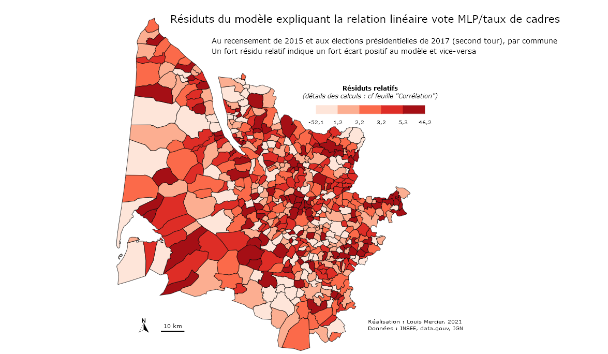
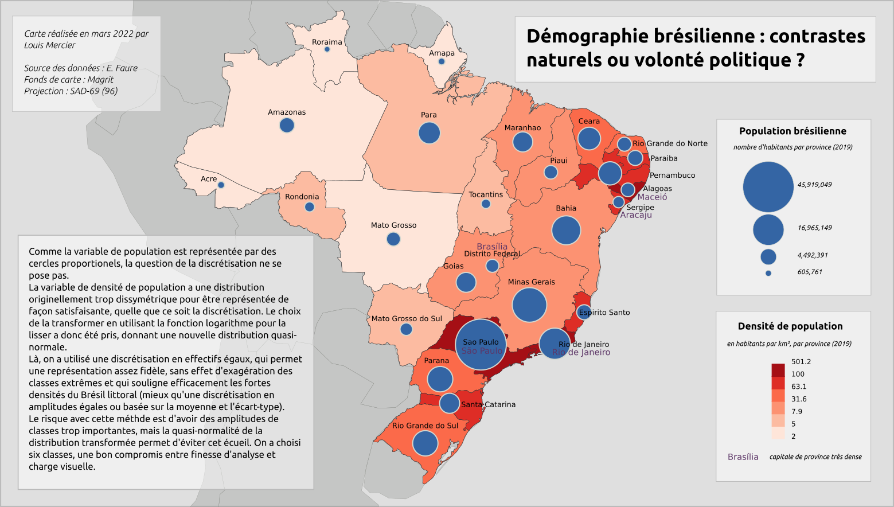
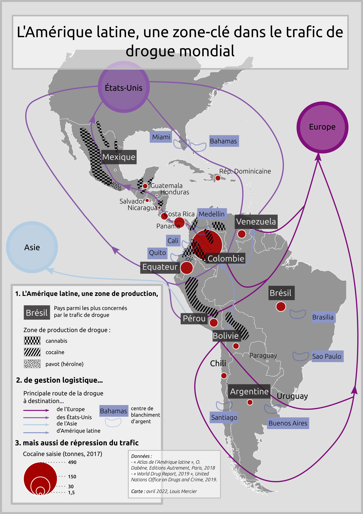
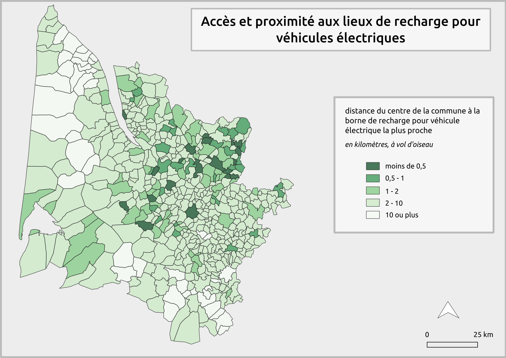
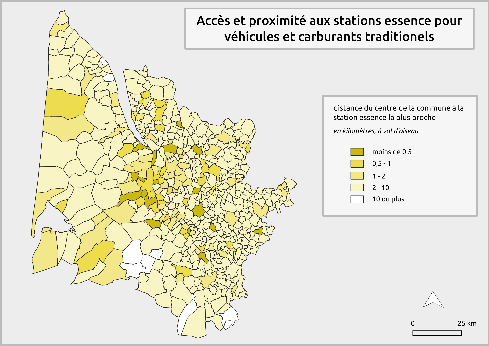
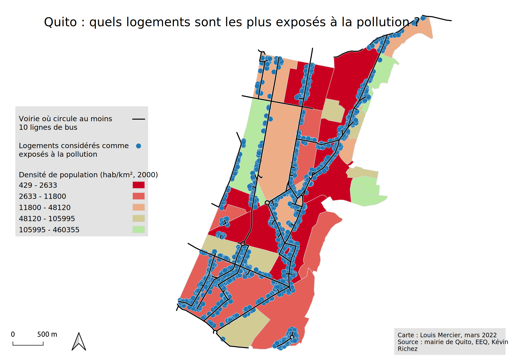

# Licence 2 (Géographie & aménagement) - Semestre 4

**Analyse statistique spatio-temporelle des résultats des élections présidentielles 2012-2017** : devoir (voir [rendu](statistiques_dm.xlsx) format tableur) étudiant la relation entre les résultats de Marine Le Pen au second tour et le taux de cadre/professions intermédiaires parmi les actifs dans les communes de Gironde.  
Cartes d'exploration des variables, montrant la [sous-représentation](stat_sousrep.png) du vote MLP, sa [sur-représentation](stat_surrep.png) ainsi que les résidus au modèle (relation linéaire vote MLP/taux de cadres), permettant d'observer les dynamiques spatiales liées au modèle (par exemple, on peut faire l'hypothèse que les espaces les plus urbains sont les plus polarisants en terme de votes MLP/taux de cadres)  

 

Cours de **cartographie** (représenter l'information géographique)
Trois rendus différents : 
- un ensemble de cartes simples à 🚧ajouter🚧
- une carte sur la démographie brésilienne + questions de discrétisation des données

- une carte sur le trafic de drogue en Amérique du Sud (+ [tableau préparatoire](carto_td3_tableau_prep.pdf))

 

Cours de **SIG et analyse spatiale**
- DM d'analyse géographique : accès à la voiture selon l'énergie utilisée ([rendu](sig_dm_analyse_geo_gironde_voiture.pdf) en pdf avec explication de la thématique, données, diagrammes de traitement, cartes de situation, cartes thématiques et commentaires)

- DM documentaire : brève frise chronologique de l'histoire des SIG

- différents exercices à 🚧migrer🚧, dont une analyse spatiale sur les logements les plus exposés à la pollution urbaine dans la ville de Quito

