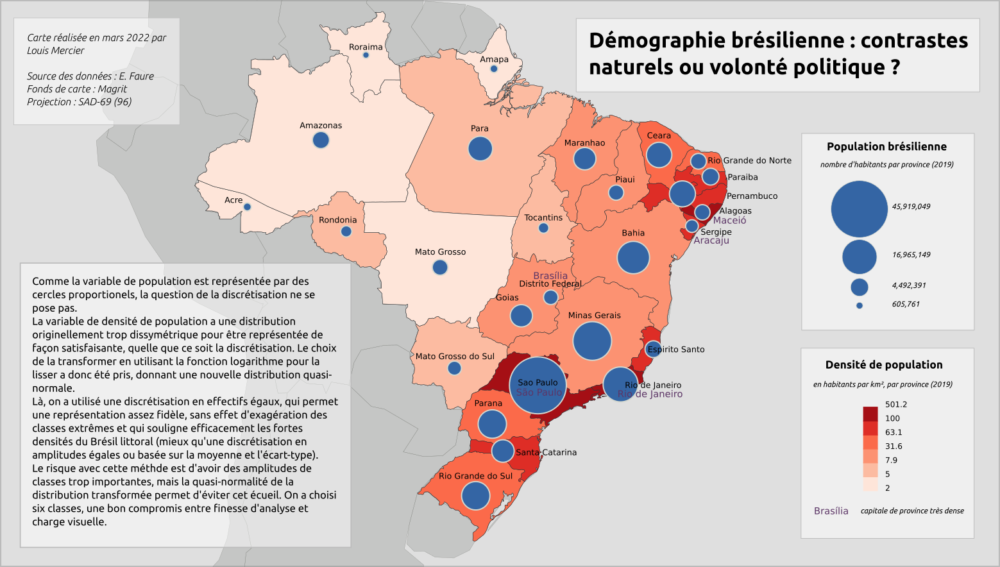

# Licence 2 (Géographie & aménagement)

## [Licence 2 Semestre 3](L2_Semestre_3)
Cartographie de l'accessibilité PMR dans le 10e arrondissement de Paris après travail de terrain  

  
Cartographie du parcours migratoire d'Hasan, réfugié syrien, et [storymap](https://storymaps.arcgis.com/stories/ec20b9a474524db6bfeb67861c51ea02) associé

 

## [Licence 2 Semestre 4](L2_Semestre_4)
Analyse statistique spatio-temporelle des résultats des élections présidentuelles 2012-2017 ; modèle expliquant la relation linéaire vote MLP/taux de cadre et cartographies diverses    

  
Cartographie & représentation de l'information géographique ; cartes diverses, dont démographie brésilienne et trafic de drogue en Amérique du Sud  

  
SIG et analyse spatiale ; cartographie de l'accès à la voiture selon l'énergie utilisée, cartographie des logements les plus exposés à la pollution dans la ville de Quito  
  

