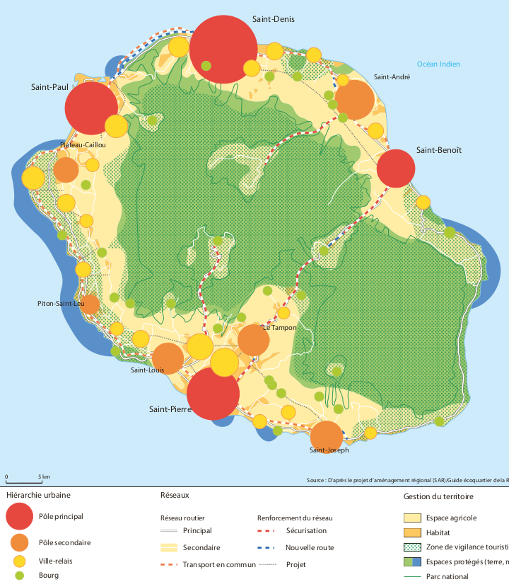
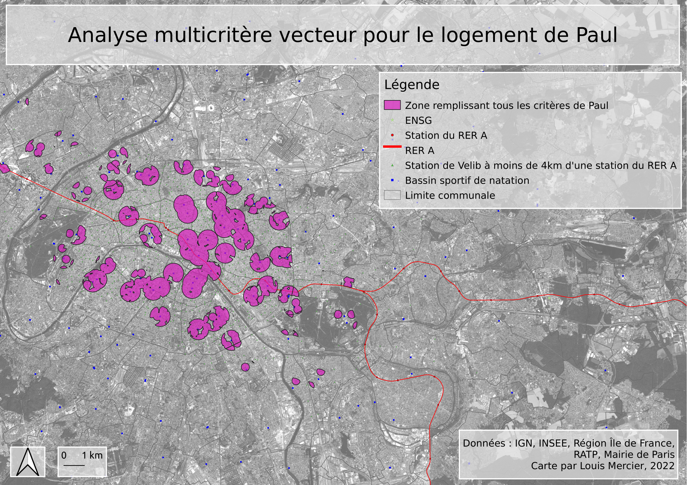
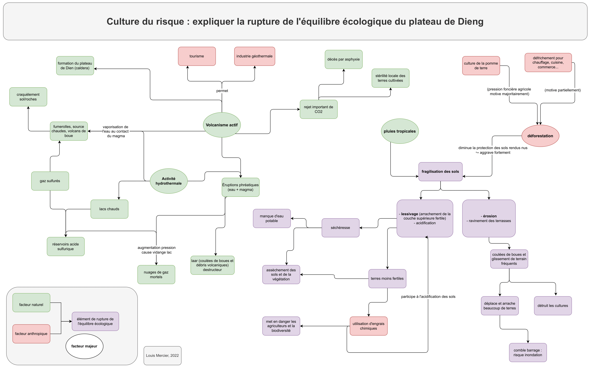

# Licence 3 (Géographie & aménagement)

Carte de La Réunion : carte réalisée sous AI (illustrator) dans le cadre d'un TD de DAO  

Analyse multicritère vecteur pour le logement de Paul : carte représentant les zones remplissant certains critères prédéfinis pour un logement dans le cadre d'un TD d'analyse spatiale par SIG  

Rupture de l'équilibre écologique du plateau de Dieng : diagramme présentant certains facteurs d'explications et leurs relations, réalisé dans le cadre d'un cours sur les interfaces homme/nature  
